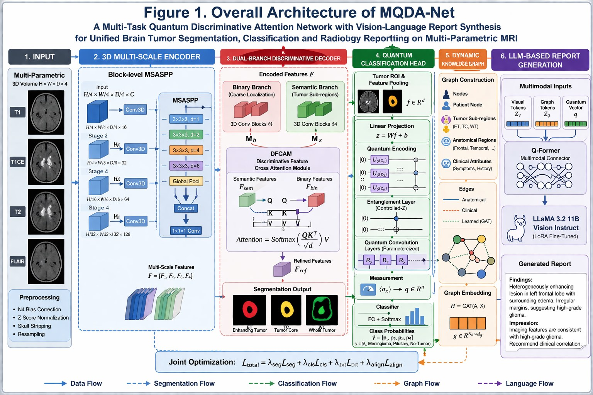

# MQDA-Net

**A Quantum-Enhanced Dual-Branch Framework for Unified Brain Tumor Segmentation, Classification and Structured Radiology Report Generation**

MQDA-Net trains three tasks together, in one training graph, from multi-parametric brain MRI (T1, T1-CE, T2, FLAIR):

1. **Volumetric segmentation** of enhancing tumor, tumor core and whole tumor.
2. **Tumor-type classification** into glioma, meningioma, pituitary tumor or no tumor.
3. **Structured radiology reports** with volumes, laterality and lobe, impression and a BT-RADS score.



| Module | Paper | Code |
|---|---|---|
| 3D MedNeXt encoder with block-level **MSASPP** (dilations 1, 2, 4, 6 + GAP, Res2Net fusion) | §3.2, Eqs. 3–4 | [`mqda/models/encoder.py`](mqda/models/encoder.py) |
| **Dual-Branch Discriminative Decoder** with **DFCAM** cross-attention at stages 3–4 | §3.3, Eqs. 5–6 | [`mqda/models/decoder.py`](mqda/models/decoder.py) |
| Segmentation loss: BCE + Dice–CE + boundary term | §3.3, Eqs. 7–8 | [`mqda/losses/segmentation.py`](mqda/losses/segmentation.py) |
| **12-qubit variational classifier**: U3 encoding, controlled-Z entanglement, 2 PQC layers × 4 kernels, Pauli-X read-out, parameter-shift gradients | §3.4, Eqs. 9–11 | [`mqda/models/quantum.py`](mqda/models/quantum.py) |
| Focal cross-entropy with label smoothing | §3.4, Eq. 12 | [`mqda/losses/classification.py`](mqda/losses/classification.py) |
| Masked pooling, radiomics, volumetric measurements | §3.4 | [`mqda/models/features.py`](mqda/models/features.py) |
| **Dynamic image-grounded knowledge graph** + z-conditioned 3-layer GAT | §3.5, Eqs. 13–14 | [`mqda/models/graph.py`](mqda/models/graph.py), [`mqda/models/kb.py`](mqda/models/kb.py), [`mqda/data/atlas.py`](mqda/data/atlas.py) |
| **Q-Former** projector + **LoRA** Llama 3.2 11B Vision-Instruct, L_txt and InfoNCE L_align | §3.6, Eqs. 15–16 | [`mqda/models/report.py`](mqda/models/report.py) |
| RadGraph-F1 **DPO** refinement | §3.6 | [`scripts/dpo_refine.py`](scripts/dpo_refine.py), [`mqda/losses/preference.py`](mqda/losses/preference.py) |
| Composite objective λ₁L_seg + λ₂L_cls + λ₃L_txt + λ₄L_align | §3.1, Eq. 2 | [`mqda/losses/total.py`](mqda/losses/total.py) |
| Full model (Eq. 1) | §3.1 | [`mqda/models/mqda_net.py`](mqda/models/mqda_net.py) |
| Metrics (Dice, IoU, HD95, ASSD, accuracy/P/R/F1, BLEU, ROUGE, METEOR, BERTScore, RadGraph-F1) | §4 | [`mqda/eval/metrics.py`](mqda/eval/metrics.py) |
| Wilcoxon signed-rank test, BCa bootstrap CIs, rank-biserial correlation, Bonferroni correction | §5.1 | [`mqda/eval/stats.py`](mqda/eval/stats.py) |

Where the paper leaves a detail open, the choice made in the code is listed in [docs/IMPLEMENTATION_NOTES.md](docs/IMPLEMENTATION_NOTES.md).

---

## Installation

```bash
git clone https://github.com/subia89/MQDA-Net.git
cd MQDA-Net
python -m venv .venv && source .venv/bin/activate
pip install torch --index-url https://download.pytorch.org/whl/cu121   # pick your CUDA build
pip install -r requirements.txt
# optional extras
pip install deepspeed bitsandbytes SimpleITK nltk rouge-score bert-score radgraph
```

To use the report generator you need access to [`meta-llama/Llama-3.2-11B-Vision-Instruct`](https://huggingface.co/meta-llama/Llama-3.2-11B-Vision-Instruct). Accept the licence on Hugging Face, then run `huggingface-cli login`. The Q-Former starts from the [`Salesforce/blip2-opt-2.7b`](https://huggingface.co/Salesforce/blip2-opt-2.7b) weights. Only the Q-Former tensors are downloaded.

### Check the installation

Two quick checks run without any data or GPU:

```bash
pytest -q                                                     # 35 unit / integration tests
python scripts/train.py --config configs/smoke_test.yaml      # stage 1 on synthetic volumes
python scripts/train.py --config configs/smoke_test_joint.yaml  # stage 2 with an offline toy LLM
```

The smoke tests only confirm that every component runs end to end. They say nothing about accuracy.

---

## Data

| Dataset | Used for | Expected layout (paths set in `configs/*.yaml`) |
|---|---|---|
| **BraTS 2023 GLI** (1,251 volumes) | segmentation, reports | `data/BraTS2023-GLI/<...>/BraTS-GLI-XXXXX-XXX/BraTS-GLI-XXXXX-XXX-{t1n,t1c,t2w,t2f,seg}.nii.gz` |
| **BraTS 2024 post-treatment** (271 volumes) | fine-tuning / transfer | same naming; label 4 (resection cavity) is mapped to background |
| **FigShare** (3,064 T1-CE slices) | classification + 2D masks | `data/figshare/*.mat` (the original `cjdata` files) |
| **Br35H** (3,000 slices: 1,500 tumor, 1,500 tumor-free) | classification, contributes the no-tumor images | `data/Br35H/{yes,no}/*.jpg` |
| **Nickparvar composite** (7,023 images, v1) | classification, primary benchmark | `data/nickparvar/{Training,Testing}/<class>/*.jpg` |
| **SARTAJ (3K-DS)** (3,264 images) | classification, supplementary | `data/3K-DS/{Training,Testing}/<class>/*.jpg` |

BraTS 2021 naming (`t1, t1ce, t2, flair`, ET = 4) is also supported with `data.naming: "2021"`.

**Reports.** Put the ground-truth reports in a JSONL file with one case per line. The `notes` field is optional and feeds the symptom nodes of the knowledge graph:

```json
{"case_id": "BraTS-GLI-00000-000", "report": "Technique: ...\nFindings: ...\nLaterality and Lobe: ...\nImpression: ...\nBT-RADS: ...", "notes": "new-onset seizures"}
```

**Splits.** Generate the split files with `scripts/make_splits.py` (see [`splits/README.md`](splits/README.md)). The BraTS 2023 split is 1,001 training and 250 test cases, and 150 of the test cases form the report test set. BraTS 2024 is split 217 / 54.

**Pre-processing.** BraTS volumes are already skull-stripped and co-registered. Raw data needs N4 bias correction and 1 mm resampling, and optionally MNI registration, before use:

```bash
python scripts/preprocess.py --in raw/case01 --out data/case01 --template MNI152_T1_1mm_brain.nii.gz
```

**Atlas.** Laterality and lobe come from intersecting the tumor mask with an anatomical atlas. For real anatomy, use a label atlas in MNI space, such as Harvard-Oxford from FSL:

```yaml
model:
  atlas: {type: nifti, label_path: atlases/HarvardOxford-cort-maxprob-thr25-1mm.nii.gz, lut_path: atlases/HarvardOxford-cort.txt}
```

The lookup table has one `id name` pair per line. The default `{type: coarse}` atlas splits the volume into hemisphere × lobe compartments by coordinate rules. It is only a rough fallback for data without a registered atlas.

---

## Training

Training runs in two stages over one shared encoder (Table 2 of the paper).

**Stage 1** presents the two cohorts in alternating task-specific steps: a segmentation step (4 BraTS volumes, `L_seg`, quantum head not in the path) and a classification step (32 2D images, `L_cls`, decoder and DFCAM not in the path). The 2D images reach the same 3D encoder through the parameter-free adaptation `A_2D→3D` — resize to 128 × 128, replicate to depth 16, replicate across the 4 sequence channels — and are pooled by global average pooling, since they carry no mask. Both step types update the shared encoder and MSASPP.

**Stage 2** trains only the graph reasoner, the Q-Former and the LoRA adapters; the encoder, MSASPP, DFCAM, decoder and quantum head are evaluated but frozen (`train.freeze_vision: true`).

```bash
# Stage 1 — both cohorts, alternating steps: 200 epochs, lr 1e-4, batch 4 (3D) / 32 (2D)
python scripts/train.py --config configs/stage1_alternating.yaml

# Stage 1, segmentation cohort only (BraTS, no classification steps)
python scripts/train.py --config configs/brats2023_vision.yaml

# Stage 2 — report components only (vision frozen): 50 epochs, lr 2e-5, batch 8,
#           2 GPUs, bf16, DeepSpeed ZeRO-2
accelerate launch --config_file configs/accelerate_zero2.yaml \
    scripts/train.py --config configs/brats2023_joint.yaml

# BraTS 2024 post-treatment fine-tuning (217 / 54)
python scripts/train.py --config configs/brats2024_finetune.yaml

# 2D classification benchmarks on their own (2D model, 224 × 224, batch 32)
python scripts/train.py --config configs/figshare_br35h.yaml
python scripts/train.py --config configs/nickparvar.yaml
python scripts/train.py --config configs/ds3k.yaml
```

You can override any config value from the command line, for example `train.epochs=100 model.q_backend=pennylane llm.load_in_4bit=true`.

Each run writes `best.pt`, `last.pt`, `history.jsonl`, `config.yaml` and, in stage 2, `lora_adapter/`. Checkpoints do not include the frozen Llama weights, which are reloaded from the Hub.

Useful switches:

- `model.q_diff_method`: `parameter-shift` (the paper's setting) or `backprop`. Both give identical gradients, and backprop is faster.
- `model.q_backend`: `torch` uses the built-in exact state-vector simulator. `pennylane` runs the same circuit on `default.qubit`.
- `llm.load_in_4bit: true` switches to QLoRA with a 4-bit frozen backbone.
- `model.graph_from_ground_truth: true` builds training graphs from the ground-truth masks instead of the predictions.
- `train.freeze_vision: true` freezes the encoder, MSASPP, DFCAM, decoder and quantum head (the report stage of Table 2).
- `train.batch_size_2d` sets the classification-step batch size in the alternating stage-1 loop.
- `model.adapt_size` / `model.adapt_depth` set the `A_2D→3D` resolution and pseudo-volume depth (128 / 16).

## Evaluation

```bash
# segmentation + classification (per-case CSV for significance testing)
python scripts/evaluate.py --checkpoint runs/brats2023_vision/best.pt --full-volume --out results/brats2023
python scripts/evaluate.py --checkpoint runs/figshare_br35h/best.pt --no-distances

# report generation + BLEU / ROUGE / METEOR / BERTScore / RadGraph-F1
python scripts/generate_reports.py --run runs/brats2023_joint

# RadGraph-F1 DPO refinement on curated preference pairs
python scripts/dpo_refine.py --run runs/brats2023_joint --pairs data/reports/dpo_pairs.jsonl

# Wilcoxon signed-rank + BCa bootstrap + Bonferroni against a baseline
python scripts/significance.py --ours results/brats2023/per_case.csv \
    --baseline results/baseline/per_case.csv --metrics dice_mean iou_mean hd95_mean correct

# module-wise parameter counts (cf. Table 15)
python scripts/count_params.py --config configs/base.yaml
```

## Inference on a single case

```bash
python scripts/infer.py --run runs/brats2023_joint \
    --case data/BraTS2023-GLI/.../BraTS-GLI-00000-000 --notes "headache, left-sided weakness"
```

The script writes:

- `<case>-pred.nii.gz` with BraTS labels 1 = NCR, 2 = edema, 3 = ET
- the class probabilities
- the measured volumes and atlas location
- the generated structured report

## Model size

`scripts/count_params.py` with the default configuration gives:

| Module | This implementation | Paper (Table 15) |
|---|---|---|
| MSASPP encoder | 28.6 M | 28.4 M |
| Dual-branch decoder + DFCAM | 31.4 M | 32.8 M |
| Quantum head (72 circuit parameters) | 7.3 M | 7.3 M |
| Knowledge graph + GAT | 1.0 M | 1.3 M |
| Q-Former projector | 46.0 M | 38.8 M |
| LoRA, rank 16 | 13.6 M | 12.0 M |

The Q-Former and LoRA sizes depend on the settings listed in the implementation notes. You can adjust them with `model.qformer_*` and `llm.lora_target_modules`.

## Repository layout

```
configs/            YAML configs (base.yaml = paper Table 1) + accelerate / DeepSpeed config
mqda/models/        encoder, decoder, quantum head, knowledge graph, report generator, full model
mqda/losses/        segmentation, classification, preference and composite losses
mqda/data/          datasets, augmentation, atlases, dataset builder
mqda/eval/          metrics and statistical tests
mqda/utils/         config loading, checkpoints, sliding-window inference
mqda/engine.py      training / validation loop
scripts/            train, evaluate, generate_reports, infer, dpo_refine, significance,
                    count_params, preprocess, make_splits
tests/              pytest suite (synthetic data, offline toy language model)
docs/               implementation notes, example knowledge-base file, figures
```

## Hardware

The paper's experiments ran on 2 × NVIDIA H100 80 GB GPUs with PyTorch 2.1, bf16 and DeepSpeed ZeRO-2 for the language stage. Smaller GPUs work with these settings:

- stage 1 with `train.batch_size=2 train.grad_accum=2`
- stage 2 with `llm.load_in_4bit=true`

## Citation

If you use this code, please cite the MQDA-Net paper. The BibTeX entry will be added once the paper is published.
